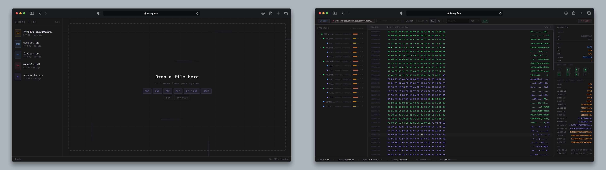

<p align="center" >
  
</p>

<h1 align="center">Binary Raw</h1>

<p align="center">
  
  
  
  
  
  <a href="LICENSE">
    
  </a>
</p>

<br/>
<p align="center" >
  <a href="https://binary-raw.pages.dev/">🚀 <strong>Live Demo</strong></a> •
  <a href="#key-features">Key Features</a> •
  <a href="#installation">Installation</a> •
  <a href="#module-architecture">Architecture</a> •
  <a href="#documentation">Documentation</a>
</p>

> ⚠️ **MVP — Minimum Viable Product.** Early functional version.

Web hex editor for technical binary analysis, developed entirely with TypeScript and native browser APIs. It employs a _Zero-Framework_ architecture to minimize execution overhead and utilizes a virtualized rendering system that enables inspection of large buffers without interface latency, integrating signature-based format detection engines and transactional state management.

<p align="center">
  <a href="https://binary-raw.pages.dev/">
    
  </a>
  <br />
  <sub>Click on the image to open the live demo</sub>
</p>

## Key Features

### Automatic Multi-Format Parsing

Dynamically detects and interprets the structure of the following file formats by their byte signature (_magic bytes_):

| Category     | Supported Formats                            |
| ------------ | -------------------------------------------- |
| Executables  | `ELF` (Linux/Unix), `PE` 32/64-bit (Windows) |
| Documents    | `PDF`                                        |
| Archives     | `ZIP`                                        |
| Images       | `PNG`, `JPEG`                                |
| Raw Binaries | `BIN` — block-level entropy analysis         |

Each parser extracts sections, headers, and structured metadata that are presented visually in the sidebar tree of the interface.

### Virtualized Hex View (Zero Lag & Semantic Highlighting)

The `hex-view` component implements **sliding-window virtualized rendering**: only the bytes currently visible on screen are injected into the DOM. This allows inspecting files hundreds of MB in size with smooth scrolling, without UI blocking or memory consumption spikes.

- **Layout:** Three columns per row (hex offset | hex values | ASCII representation).
- **Semantic Highlighting:** Automatically color-codes bytes based on their role:
  - **`Header / Magic` (Purple):** File signatures and critical metadata.
  - **`Structured` (Blue):** Bytes belonging to parsed sections (sections, segments).
  - **`Modified` (Yellow):** Bytes edited during the current session.
  - **`Null` (Dimmed):** Zero bytes for easier structure visualization.

### Real-Time Data Inspector

Clicking or selecting one or more bytes triggers the **`inspector`** side panel to decode them on the fly into:

- **Integers:** `Int8`, `UInt8`, `Int16`, `UInt16`, `Int32`, `UInt32`, `Int64`, `UInt64` — in both `Little Endian` and `Big Endian` variants.
- **Floating Point:** `Float32`, `Float64`.
- **Strings & Encodings:** `ASCII`, `UTF-8`, `UTF-16`, `UTF-32`, and `Latin-1`.
- **Bit view:** individual bit decomposition (`b0` → `b7`) of the byte under the cursor.
- **Time/Date:** Automatic Unix timestamp detection (converts 4/8 byte sequences to ISO dates).
- **Color Preview:** Real-time RGB/RGBA swatch for 3 or 4-byte selections.
- **Data Export:** Instant **Base64** encoding of the active selection.

### Robust History Control (Undo / Redo)

A custom-built exhaustive state machine that seamlessly handles **byte replacements and range edits**. Guarantees complete reversibility of all edit operations via in-memory command stacks with O(1) access. Each command stores the old and new values for every affected byte, enabling precise bidirectional replay.

### Domain-Driven & Type Safe (Branded Types)

Uses _Branded Types_ throughout the type system (`AbsoluteOffset`, `ByteCount`, `VirtualAddress`), preventing semantic mix-ups in numeric operations or index accesses that could result in silent logic errors. All arithmetic on binary offsets is strictly bounded and validated at compile time.

### Byte Pattern Search

Integrated search engine (`search.ts`) that locates arbitrary byte sequences within the active buffer, supporting **hex**, **ASCII**, and **UTF-8** input modes, with visual highlighting of matches in the hex view and toolbar navigation (next / previous result, up to 1,000 matches).

### Recent Files Management

- **Recent Files Management:** `recents.ts` module that persists the history of recently opened files via **IndexedDB**, ensuring persistence across browser sessions. Allows quick reopening of previous files from the welcome screen, including file format and size metadata.

### Entropy Analysis

Block-level Shannon entropy calculation (`entropy.ts`), useful for identifying plaintext zones, compressed data, or encrypted segments in arbitrary binaries.

## Installation

### 1. Install Dependencies

```bash
npm install
```

### 2. Available Scripts

The project provides several pre-configured commands for the development lifecycle (defined in `package.json`):

```bash
# Development server with native HMR (port 5173, opens browser automatically)
npm run dev

# Type-check without emitting code — ideal for CI or pre-commit hooks
npm run typecheck

# Build optimized production bundle → /dist
npm run build

# Clean the /dist output directory (cross-platform)
npm run clean

# Preview the production build on localhost
npm run preview

# Run tests in watch mode (interactive development)
npm run test

# Run tests once (ideal for CI/CD pipelines)
npm run test:run

# Generate code coverage report with V8
npm run coverage

# Generate API documentation with TypeDoc → /docs
npm run docs
```

> **Note:** The development server starts at `http://localhost:5173` with `strictPort: true` — if the port is already in use, Vite will throw an error instead of trying another port.

---

## Module Architecture

The source tree (`/src`) is structured in layers with strictly separated responsibilities:

```
src/
├── main.ts                   # Entry point: initializes the app and manages sessionStorage
├── vite-env.d.ts             # Vite environment declarations
│
├── types/
│   └── index.ts              # Branded Types, domain events, analytical structures
│
├── core/
│   ├── buffer.ts             # In-memory byte buffer management (read / write / patches)
│   ├── editor.ts             # Editor engine: Undo/Redo command stack, edit state
│   ├── search.ts             # Byte pattern search engine (hex, ASCII, UTF-8 modes)
│   ├── selection.ts          # Byte range selection management
│   └── parsers/
│       ├── index.ts          # Automatic parser dispatcher by file signature
│       ├── elf.ts            # ELF parser (sections, program headers, segments)
│       ├── pe.ts             # PE 32/64-bit parser (DOS header, NT headers, sections)
│       ├── jpeg.ts           # JPEG parser (EXIF markers, APP0, SOF, DQT)
│       ├── pdf.ts            # PDF parser (xref table, objects, streams)
│       ├── png.ts            # PNG parser (IHDR, IDAT, tEXt chunks, metadata)
│       └── zip.ts            # ZIP parser (central directory, local file headers)
│
├── ui/
│   ├── screens/
│   │   ├── welcome.html      # Welcome screen HTML template
│   │   ├── welcome.ts        # Welcome screen logic and file loading
│   │   ├── editor.html       # Main editor HTML template
│   │   └── editor.ts         # Editor screen orchestrator (mounts and wires all components)
│   └── components/
│       ├── drop-zone.ts      # Drag & drop area for file loading
│       ├── hex-view.ts       # Virtualized hex view (sliding-window rendering)
│       ├── inspector.ts      # Inspector panel: on-the-fly byte decoding
│       ├── sidebar.ts        # Sidebar tree of parsed file sections
│       ├── status-bar.ts     # Status bar: offset, size, active selection
│       └── toolbar.ts        # Toolbar: file and edit actions, search input
│
├── styles/
│   ├── tokens.css            # Design tokens: global CSS variables (colors, fonts, spacing)
│   ├── base.css              # Document reset and base styles
│   ├── welcome.css           # Welcome screen specific styles
│   └── editor.css            # Editor and all component styles
│
└── utils/
    ├── encoding.ts           # Encoding/decoding utilities (ASCII, UTF-8)
    ├── entropy.ts            # Block-level Shannon entropy calculation
    ├── hex.ts                # Hexadecimal conversion and formatting
    ├── recents.ts            # Recent files history persistence
    └── storage.ts            # Abstraction over sessionStorage/localStorage
```

### Data Flow

The orchestrator is `ui/screens/editor.ts`, which mounts all components and wires the data paths after the file is loaded:

```
File (File API / Drag & Drop)
        │
        ▼
   buffer.ts ─────────────────────► parsers/index.ts
   (loads ArrayBuffer)                      │
        │                         detects format, dispatches
        │                                   │
        │                                   ▼
        │                           ELF / PE / PNG / ...
        │                                   │
        │                           SectionNode[]
        │                                   │
        ▼                                   ▼
   editor.ts (core)               sidebar.ts
   (initEditor: Undo/Redo          (section tree UI)
    command stack, modified
    byte cache)
        │
        ├──► hex-view.ts
        │    (renders visible bytes; subscribes to
        │     onEditorChange for dirty-byte highlights;
        │     emits pointer events → selection.ts)
        │
        ├──► selection.ts
        │    (tracks active byte range;
        │     onSelectionChange ──► inspector.ts
        │                     └──► status-bar.ts)
        │
        ├──► inspector.ts
        │    (decodes selected / hovered bytes on the fly;
        │     refreshed by onEditorChange for live edits)
        │
        ├──► status-bar.ts
        │    (cursor offset, file size, selection length)
        │
        ├──► toolbar.ts
        │    (column selector, search input)
        │         │
        │         └──► search.ts
        │              (findAll over buffer;
        │               results → selection.ts + hex-view scroll)
        │
        └──► sidebar.ts
             (section click → inspector.setSection +
              hex-view.scrollToOffset)
```

## Documentation

Technical documentation generated from the project's source code using **TypeDoc**.

**Documentation:** [https://pgomur.github.io/binary-raw/index.html](https://pgomur.github.io/binary-raw/index.html)
